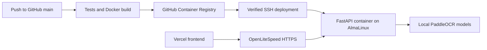

# Hostinger AlmaLinux + Vercel deployment

| Component | Configuration |
|---|---|
| GitHub | `https://github.com/Rvjais/OCR-SHEET` |
| Frontend | `https://ocr-sheet-topaz.vercel.app` |
| VPS | `72.61.224.90`, AlmaLinux 9.8 |
| Backend URL | `https://72-61-224-90.sslip.io` |
| Container base | `python:3.12-slim-bookworm`, Debian with Python 3.12 |
| Image registry | `ghcr.io/rvjais/ocr-sheet-backend:<commit-sha>` |
| Reverse proxy | Existing OpenLiteSpeed, forwarding to `127.0.0.1:8010` |
| Local models | PP-OCRv5 detector and handwriting-capable recognizers, defined in `backend/ocr.py` |

The host remains AlmaLinux. Docker installs PaddleOCR and bundles the model weights for every supported language during the image build. Recognition uses CPU inference on this VPS, with no external OCR service or API key. The backend loads the English models before accepting requests.

No domain purchase is needed. [sslip.io](https://sslip.io/) resolves the IP-based hostname to this VPS, and Let's Encrypt supplies the HTTPS certificate. This depends on sslip.io availability and retaining this VPS IP. Existing websites continue using the same OpenLiteSpeed listeners.



## One-time VPS setup

These instructions reproduce the setup; do not reinstall AlmaLinux or disable the existing web server.

```bash
ssh root@72.61.224.90
git clone https://github.com/Rvjais/OCR-SHEET.git /root/textlens-setup
cd /root/textlens-setup
bash deploy/bootstrap-almalinux.sh
```

The bootstrap installs Docker Engine and Compose from Docker's CentOS-compatible RPM repository, creates `textlens-deploy`, prepares `/opt/textlens`, and preserves OpenLiteSpeed. [Docker RPM installation documentation](https://docs.docker.com/engine/install/centos/).

Edit `/opt/textlens/.env`:

```dotenv
BACKEND_DOMAIN=72-61-224-90.sslip.io
FRONTEND_ORIGINS=https://ocr-sheet-topaz.vercel.app
OCR_CPU_THREADS=4
PUBLIC_OCR_PER_MINUTE=12
PUBLIC_OCR_PER_DAY=500
PUBLIC_OCR_CONCURRENT=2
```

Keep the file owned by `textlens-deploy` with mode 600. Do not commit credentials or put them in the frontend. A Git-ignored local `.env.production` can hold your private backup.

The app offers tick boxes for **Printed text** and **Printed + handwritten text**, with one mode active at a time. Handwriting uses the bundled local models automatically; printed mode runs Tesseract in the browser. Users do not enter tokens, keys or model IDs. Development and deployment status are kept out of the product interface. Operators can check `https://72-61-224-90.sslip.io/api/health` for `status: ok` and the deployed commit in `version`.

The public endpoint defaults to 12 OCR requests per minute, 500 requests per rolling 24 hours, and two concurrent requests, across the server. These limits apply before images are decoded or recognized locally; excess requests receive 429 with a Retry-After header. Adjust the environment values above to match expected usage. Counters are held in this single container's memory and reset on restart/deployment. They are usage bounds, not individual user authentication.

## HTTPS on the existing OpenLiteSpeed server

Run once on the VPS:

```bash
python3 /root/textlens-setup/deploy/configure-openlitespeed.py
certbot certonly --webroot -w /var/www/textlens/html \
  -d 72-61-224-90.sslip.io --non-interactive --agree-tos \
  --register-unsafely-without-email
python3 /root/textlens-setup/deploy/configure-openlitespeed.py --tls

cp /root/textlens-setup/deploy/textlens-cert-renew.service /etc/systemd/system/
cp /root/textlens-setup/deploy/textlens-cert-renew.timer /etc/systemd/system/
systemctl daemon-reload
systemctl enable --now textlens-cert-renew.timer
```

The configuration script adds the `textlens_ocr` virtual host and listener mappings, backs up the original configuration, checks for new validation errors, and gracefully reloads OpenLiteSpeed. Other websites' mappings and default certificates are retained. Repeating setup preserves an already-issued TextLens certificate.

Allow TCP 80/443 in the Hostinger firewall. Those ports already serve your websites. Docker publishes only **127.0.0.1:8010**, not a public port. Keep SELinux's existing mode. With an enforcing policy, permit the web server's local upstream connection through the appropriate policy rather than disabling SELinux. [OpenLiteSpeed reverse proxy documentation](https://docs.openlitespeed.org/config/reverseproxy/), [SSL documentation](https://docs.openlitespeed.org/security/ssl/).

The renewal timer checks twice daily, renews only this certificate, and gracefully reloads the proxy after renewal. HTTPS credentials stay on the VPS and are not part of Docker images.

## GitHub Actions configuration

Create a GitHub Environment named **production**. Configure these repository Actions secrets (environment secrets also work):

| Secret | Value |
|---|---|
| `VPS_SSH_KEY` | Dedicated deployment SSH private key, including BEGIN/END lines |
| `VPS_KNOWN_HOSTS` | Verified public SSH host key for `72.61.224.90` |

For manual setup, create the dedicated key on the VPS and install its public half:

```bash
ssh-keygen -t ed25519 -f /root/textlens-actions -N '' -C textlens-github-actions
{ printf 'restrict '; cat /root/textlens-actions.pub; } >> /home/textlens-deploy/.ssh/authorized_keys
chown textlens-deploy:textlens-deploy /home/textlens-deploy/.ssh/authorized_keys
chmod 600 /home/textlens-deploy/.ssh/authorized_keys
restorecon -R /home/textlens-deploy/.ssh
```

Copy the private key into GitHub's secret. Generate the known-hosts line through a trusted Hostinger console:

```bash
printf '72.61.224.90 '
cat /etc/ssh/ssh_host_ed25519_key.pub
```

Copy the resulting `72.61.224.90 ssh-ed25519 ...` line into `VPS_KNOWN_HOSTS`. With a custom SSH port, use `[72.61.224.90]:PORT` as the prefix. The pipeline checks this key rather than trusting an unknown SSH server.

Docker group membership gives the deploy user administrative control through Docker. Restrict the deployment key and repository write access to trusted maintainers.

Add this **repository Actions variable**:

| Variable | Value |
|---|---|
| `ENABLE_VPS_DEPLOY` | `true` |

Until enabled, tests/build/publish run and VPS deployment is skipped. Optional variables default to `VPS_HOST=72.61.224.90`, `VPS_USER=textlens-deploy`, and `VPS_PORT=22`.

The pipeline publishes an image on pushes to `main` and manual runs on `main`. Pull requests only run tests. Each image is tagged with the commit SHA and linked to this repository. GitHub's short-lived `GITHUB_TOKEN` publishes and pulls the private image; no separate registry PAT is needed. It travels over SSH stdin, uses a temporary Docker login directory, and is removed after deployment. [GitHub publishing documentation](https://docs.github.com/en/actions/tutorials/publish-packages/publish-docker-images).

## Automatic updates

Push to `main`, or use Actions → **Test and deploy OCR backend** → Run workflow.

The workflow tests the code, checks scripts, builds a non-root image, smoke-tests its production filesystem restrictions and authentication, and publishes it. Over verified SSH it transfers only Compose and deploy scripts, pulls the image, and starts the container. It also performs real invoice OCR in a read-only container with network access disabled before publishing. No OCR API credentials are needed. Old cloud-key entries in the VPS configuration are ignored and can be deleted.

Success requires a healthy container and an HTTPS health response containing `status: ok`, the expected commit, `available: true`, `loaded: true`, and `requires_access_token: false`. Startup has up to five minutes to initialize the local models. Failed pulls preserve the current release; failures after replacement restore the previous image. The shared `.env` and one-time proxy configuration are not rolled back. Container replacement can cause a brief interruption.

The frontend's API address is in `runtime-config.js`. Vercel must deploy it with `index.html` and `extraction-utils.js`. Local development keeps local discovery.

## Logs and rollback

As the deploy user:

```bash
cd /opt/textlens/current
export TEXTLENS_IMAGE="$(cat .image)"
docker compose --env-file /opt/textlens/.env ps
docker compose --env-file /opt/textlens/.env logs --tail=100 api
```

Restore a successful release whose image is cached:

```bash
bash /opt/textlens/releases/PREVIOUS_COMMIT/deploy.sh \
  "$(cat /opt/textlens/releases/PREVIOUS_COMMIT/.image)"
```

If the image is no longer cached, rerun its workflow or temporarily log in with a `read:packages` credential. After editing the VPS `.env`, rerun the workflow to recreate the container. Releases/images are retained for rollback; monitor disk use and retain the versions you need.

| Symptom | Check |
|---|---|
| SSH failure | GitHub secrets, authorized_keys, host key, SSH port |
| GHCR pull denied | Image repository association and workflow package permission |
| HTTPS fails | DNS, OpenLiteSpeed mappings, certificate/renewal, firewall |
| CORS error | Exact `FRONTEND_ORIGINS` and latest Vercel version |
| Server limit 429 | Wait according to Retry-After, or adjust the VPS public usage limits |
| OCR unavailable | Container logs, bundled model files, RAM and CPU availability |

The new backend image is larger because it contains PaddlePaddle and all model weights. The first build and pull will take longer. Inference is serialized to bound CPU and memory use; two admitted requests can queue for the same engine. Adjust `OCR_CPU_THREADS` to fit the VPS alongside its existing websites. Health checks confirm model loading; the offline CI smoke test checks actual recognition. Handwriting still needs review, especially on small or blurred scans.
